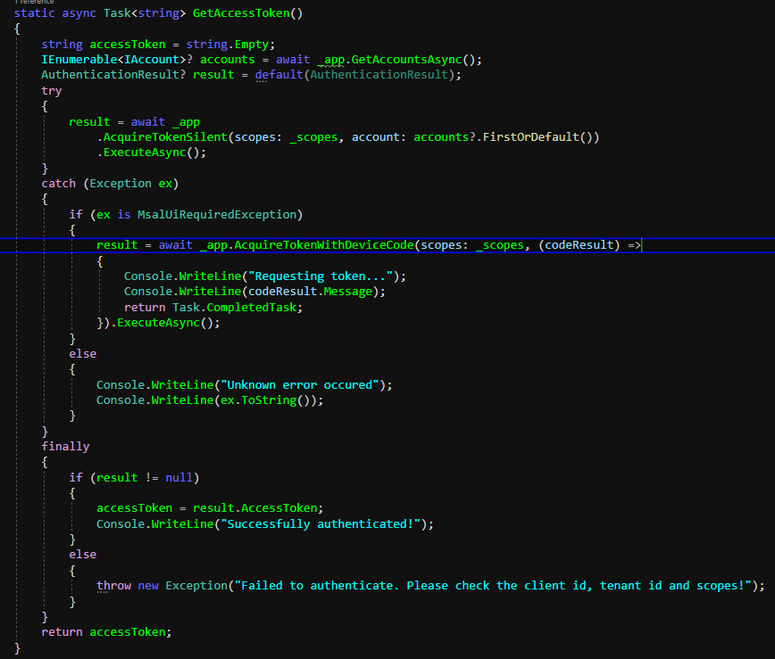

# Auth Series #4 - Call ASP.NET Core API Protected By Azure AD/Microsoft Entra ID via Console App Using Device Code Flow


This is 4th tutorial of the **Auth Series**. In tutorial, we are going to make a simple 
console application built on top of .NET 7x and will call the api protected by Azure AD/Microsoft Entra ID.
I encourage you to follow 2nd tutorial in here: [Auth Series #2 - Protect ASP.NET Core Api with Azure Entra ID and Access It via Postman](https://github.com/mirzaevolution/Uptec-Protected-Web-Api).
The 2nd tutorial is about a setup for the api to be protected by Azure AD/Microsoft Entra ID. 
Also, it's optional to read the 3rd tutorial that talks about calling the api via console app 
using **Client Credentials Flow** in here: [Auth Series #3 - Call ASP.NET Core API Protected by Azure AD/Microsoft Entra ID via Console Client Credentials Flow](https://github.com/mirzaevolution/Uptec-Call-Protected-Api-Client-Credentials).


The console application we'd like to build is almost the same like in the 3rd tutorial. 
The difference is, we will make use of device code flow and this flow is public client application not 
confidential client application like in the 3rd tutorial.

So we have to make sure to turn on the **Allow Public Client Flow** in the Azure Portal.

**Requirements:**

- Framework: .NET 7x Console Project
- Nuget: Microsoft.Identity.Client and Microsoft.Identity.Client.Extensions.Msal

The **Microsoft.Identity.Client.Extensions.Msal** library is used to store & retrieve the access token 
we have obtained. So, the next calls (as long as the token doesn't expire) don't require calling the token endpoint again. 
This way, it will speed-up the application authentication process.

Let's start for the 1st step.

### 1. Enable "Allow Public Client Flow"


If you follow our previous tutorial, we have created two new app registrations:

 - uptec-auth-api: This app registration used by our protected WeatherForecast api
 - uptec-auth-api-caller: This app registration used client apps to call the protected api

Now, we need to go to **uptec-auth-api-caller** app registration to enable the Allow Public Client Flow option.


On the selected app registration, don't forget to take a note these following things:
 
 - Client Id
 - Tenant Id
 - Scopes


If you follow previous tutorials, we have added a permission for **Access.Read** scope from **uptec-auth-api** 
app registration. Now, go to API Permissions, click the Access.Read permission, copy the scope permission there.

**NB: If you don't see what shown in below screenshot, make sure you follow our 2nd tutorial.**


### 2. Create Console Application

Create default console application in Visual Studio, and give the name as you wish.


Once created, open the **Manage Nuget Package**, and install these packages:

 - Microsoft.Identity.Client
 - Microsoft.Identity.Client.Extensions.Msal


### 3. Implement The Code

On the **Program.cs**, add these namespaces:

```
using Microsoft.Identity.Client;
using Microsoft.Identity.Client.Extensions.Msal;
using System.Net.Http.Headers;

```

Inside the Program class, add the following private members. 
Some of them are related to Client Id, Tenant Id and Scopes we saw earlier.

```

        #region Private Members

        //client id of the caller (uptec-auth-api-caller)
        private static readonly string _clientId = "CALLER_CLIENT_ID";

        //tenant id of the caller (uptec-auth-api-caller)
        private static readonly string _tenantId = "CALLER_TENANT_ID";

        //list of scopes we have defined. In our example only one scope: Access.Read
        private static readonly string[] _scopes =
        {
            "api://3a9b9211-6791-4992-b779-bb05935f708b/Access.Read"
        };

        //storage token cache using MSAL extension library
        private static StorageCreationProperties? _tokenCacheStorage = null;

        //cache helper to register and refresh the token
        private static MsalCacheHelper? _cacheHelper = null;

        //public client app instance for getting the access token from token endpoint
        private static IPublicClientApplication? _app = null;

        //web api base address
        private static readonly string _apiBaseAddress = "https://localhost:8181";
        #endregion
```


Ok, now we need to add a method to initiate the login. This method will prepare from 
creating the storage cache helper until the **PublicClientApplication** initialization.
Because this app uses Device Code flow, we should use public client option and no need for Client Secret.

The **StorageCreationPropertiesBuilder** and **MsalCacheHelper** are responsible to store and retrive saved token 
we gain using **PublicClientApplication** instance to a file in our system. In our sample, we name it: **'token.cache'**.


```
        static async Task InitiateLogin()
        {
            _tokenCacheStorage =
                new StorageCreationPropertiesBuilder("token.cache", MsalCacheHelper.UserRootDirectory)
                .Build();

            _cacheHelper = await MsalCacheHelper.CreateAsync(_tokenCacheStorage);

            try
            {
                _cacheHelper.VerifyPersistence();
            }
            catch (Exception ex)
            {
                Console.WriteLine("Error while verifying cache persistence. Skipping this process.");
                Console.WriteLine(ex.ToString());
            }

            _app = PublicClientApplicationBuilder
                .Create(clientId: _clientId)
                .WithTenantId(tenantId: _tenantId)
                .WithDefaultRedirectUri()
                .Build();

            _cacheHelper.RegisterCache(_app.UserTokenCache);

        }
```


Add the InitiateLogin method to static constructor for the Program class. By doing this, 
once the program starts, the InitiateLogin will be called automatically.

```
        static Program()
        {
            InitiateLogin().Wait();
        }
```


The next one is GetAccessToken method. This is a crucial method as it will be called multiple times. 
The logic is, we will try to acquire the token silently (from the cache). If the token exists and doesn't expire, 
we will use it. But, if token doesn't exist or expire, we will do a login process using Device Code Flow mechanism.

```
        static async Task<string> GetAccessToken()
        {
            string accessToken = string.Empty;
            IEnumerable<IAccount>? accounts = await _app.GetAccountsAsync();
            AuthenticationResult? result = default(AuthenticationResult);
            try
            {
                result = await _app
                    .AcquireTokenSilent(scopes: _scopes, account: accounts?.FirstOrDefault())
                    .ExecuteAsync();
            }
            catch (Exception ex)
            {
                if (ex is MsalUiRequiredException)
                {
                    result = await _app.AcquireTokenWithDeviceCode(scopes: _scopes, (codeResult) =>
                    {
                        Console.WriteLine("Requesting token...");
                        Console.WriteLine(codeResult.Message);
                        return Task.CompletedTask;
                    }).ExecuteAsync();
                }
                else
                {
                    Console.WriteLine("Unknown error occurred");
                    Console.WriteLine(ex.ToString());
                }
            }
            finally
            {
                if (result != null)
                {
                    accessToken = result.AccessToken;
                    Console.WriteLine("Successfully authenticated!");
                }
                else
                {
                    throw new Exception("Failed to authenticate. Please check the client id, tenant id and scopes!");
                }
            }
            return accessToken;
        }
```




The next methods will be GetHttpClient and InvokeApiEndpoint methods. 
Here, we will fetch api endpoint and utilize the access token. 

```
        static async Task<HttpClient> GetHttpClient()
        {
            string accessToken = await GetAccessToken();
            var client = new HttpClient
            {
                BaseAddress = new Uri(_apiBaseAddress)
            };
            client.DefaultRequestHeaders.Authorization =
                new AuthenticationHeaderValue("Bearer", accessToken);
            return client;

        }

        static async Task InvokeApiEndpoint()
        {
            var client = await GetHttpClient();
            string path = "/WeatherForecast";
            Console.WriteLine($"\nCalling {path}....");
            string response = await client.GetStringAsync(path);
            Console.WriteLine("Response:");
            Console.WriteLine(response);
        }
```


Last method, we will add logic inside the Main method to choose whether or not we will fetch the api or quit. 
This way, we can test to fetch again and again to see that in the next fetch, we don't need to login anymore (still using the token cache).

```
        static void Main(string[] args)
        {
            string? input;

            while (true)
            {
                Console.Write("\nPress 1 to invoke api endpoint or 2 to quit: ");
                input = Console.ReadLine()?.Trim();
                if (int.TryParse(input, out int result))
                {
                    switch (result)
                    {
                        case 1:
                            InvokeApiEndpoint().GetAwaiter().GetResult();
                            break;
                        case 2:
                            return;
                    }
                }
                else
                {
                    Console.WriteLine("Invalid input!");
                }
            }
        }
```


### 4. Test The Application

Before we test our console client app, we should run our previous WeatherForecast protected api. 
To do so, open the project in Visual Studio, and run it.


Now, we can run our console app. Choose the **'1'** to fetch the token and api.


Once you hit the Enter, you will be given a link and a code. You need to copy past the link in the browser 
and also in the text box of webpage, enter the code you get from console.


If nothing goes wrong, you will see that our console client app can fetch the api successfully.


Now, try to enter **'1'** again and you'll notice that we don't need to login again even 
if you close the app and run it again. 


On Windows OS, to check the token cache file, you can go to Local folder like in the screenshot below.


Ok, i think that's all for this tutorial. The next topic we will talk about calling protected api via 
web application.

Thank you.


> Sample project: https://github.com/mirzaevolution/Uptec-Calls-Protected-Api-Device-Code-Flow


Regards,

**Mirza Ghulam Rasyid**